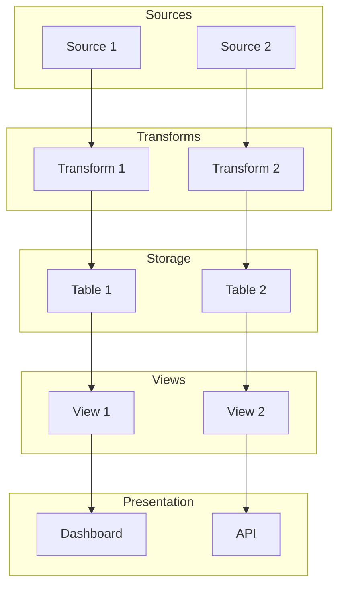

# Workflow: map

Data lineage mapping — trace every field from source through transforms to final views and presentation.

## Process

### 1. Inventory Sources

Scan the project for data files and external sources:

```markdown
## Data Sources

| # | Source | Type | Location | Description |
|---|--------|------|----------|-------------|
| 1 | Pi Sensors | Live API | HTTP :8080/sensors | Raw sensor readings |
| 2 | NASA DONKI | External API | api.nasa.gov | CME events |
| 3 | crop-profiles.json | Static file | data/nutrition/ | Crop reference data |
| 4 | USDA FoodData | External ref | fdc.nal.usda.gov | Nutrition validation |
```

### 2. Inventory Transforms

Identify all transform steps between source and storage:

```markdown
## Transforms

| # | Transform | Input | Output | Logic |
|---|-----------|-------|--------|-------|
| 1 | Mars Transform | Earth sensor readings | Mars-adjusted values | Temp offset, pressure scale, radiation multiply |
| 2 | VPD Calculator | temp_c, humidity_pct | vpd_kpa | Tetens formula |
| 3 | Nutrition Projector | crop yields, nutrition facts | coverage percentages | yield * nutrient_per_kg / requirement |
```

### 3. Inventory Storage

Map all storage locations:

```markdown
## Storage

| # | Store | Type | Key Design | Description |
|---|-------|------|------------|-------------|
| 1 | eden_telemetry | DynamoDB | PK=zone_id SK=timestamp | Zone sensor time-series |
| 2 | crop-profiles.json | JSON file | name | Static crop reference |
```

### 4. Inventory Views

Map all computed/materialized views:

```markdown
## Views

| # | View | Sources | Refresh | Purpose |
|---|------|---------|---------|---------|
| 1 | nutritional_coverage | crop_instance + crop_profile + crew_requirements | On harvest | Dashboard nutrition panel |
| 2 | water_budget | telemetry + system + crop_instance | Per tick | Water management |
```

### 5. Generate Lineage Diagram

Create a Mermaid flowchart showing the full data flow:



### 6. Field-Level Lineage (optional, for critical fields)

For high-value fields, trace the exact path:

```markdown
## Field Lineage: `nutritional_coverage.protein_pct`

| Step | Field | Source | Transform |
|------|-------|--------|-----------|
| 1 | protein_g | crop-profiles.json | — (static) |
| 2 | total_yield_kg | crop_instance.area * crop_profile.yield_per_m2 * cycles | Multiply |
| 3 | produced_g | total_yield_kg * protein_g * 10 | Unit conversion (kg -> 100g portions) |
| 4 | required_g | 60g * 4 crew * 450 sols | Multiply |
| 5 | coverage_pct | produced_g / required_g * 100 | Division |
```

### 7. File Inventory

List all data files with their schema mapping and status:

```markdown
## File Inventory

| File | Maps To | Version | Status |
|------|---------|---------|--------|
| data/crop-profiles.json | T4 crop_profile | v2.0 | Current |
| data/sensor-baseline.json | T1 telemetry | v1 | STALE |
```

## Output Format

```markdown
## Data Lineage: [project name]

### Sources
[Table from step 1]

### Transforms
[Table from step 2]

### Storage
[Table from step 3]

### Views
[Table from step 4]

### Lineage Diagram
[Mermaid from step 5]

### File Inventory
[Table from step 7]
```

## Execution

Use Glob to find data files, Grep to find import/read patterns in code, Read to understand transforms. Build the lineage from both directions: forward (source -> store) and backward (view -> what feeds it).
