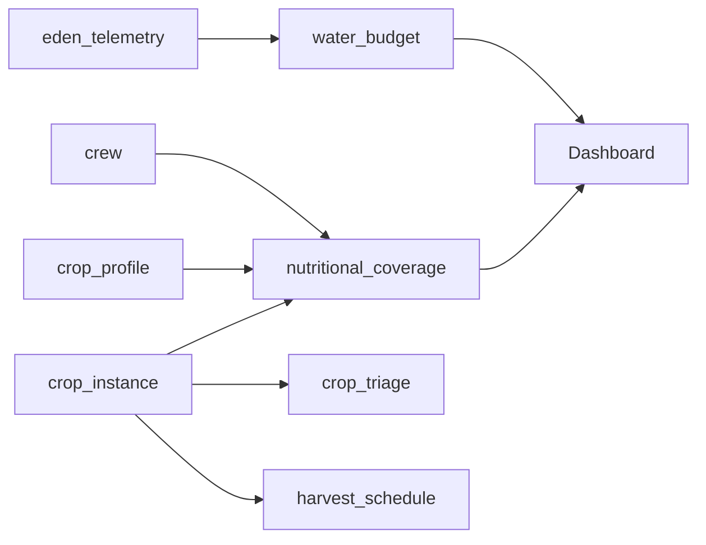

# Workflow: materialize

Define computed views — aggregations, projections, and derived datasets with explicit formulas and dependency chains.

## Process

### 1. Identify View Requirements

For each view, determine:
- **Purpose** — What question does this view answer?
- **Consumer** — Who reads it? (Dashboard panel, agent, API)
- **Refresh trigger** — When does it need to update? (Real-time, on event, periodic)
- **Source tables** — What base data feeds it?

### 2. Define View Schema

```markdown
### V[N]: `view_name`

**Purpose:** [What question it answers]
**Consumer:** [Dashboard / Agent / API]
**Refresh:** [Per tick / On harvest / On event / Periodic]
**Sources:** [Table1, Table2, ...]

| Field | Type | Source | Formula |
|-------|------|--------|---------|
| nutrient | string | — | Dimension (iteration variable) |
| required | float | crew_requirements | daily_per_astronaut * crew_size * mission_days |
| produced | float | crop_instance + crop_profile | SUM(yield_kg * nutrient_per_100g * 10) |
| coverage_pct | float | computed | produced / required * 100 |
| severity | enum | computed | CASE WHEN 0 THEN critical_zero WHEN <10 THEN critical ... |
```

### 3. Document Computation Logic

Write the view as pseudocode — precise enough to implement in any language:

```
FOR EACH nutrient IN [calories, protein, fat, carbs, fiber, ...]:
  required  = daily_per_astronaut[nutrient] * crew_size * mission_days
  produced  = SUM(
    FOR EACH crop IN active_crops:
      crop.total_yield_kg * crop.nutrition_per_100g[nutrient] * 10
  )
  coverage  = produced / required * 100
  severity  = CASE
    WHEN coverage == 0   THEN "critical_zero"
    WHEN coverage < 10   THEN "critical"
    WHEN coverage < 50   THEN "high"
    WHEN coverage < 80   THEN "moderate"
    WHEN coverage < 120  THEN "adequate"
    ELSE "surplus"
  END
  EMIT {nutrient, required, produced, coverage, severity}
```

### 4. Dependency Graph

Map which views depend on which tables and other views:



Identify:
- **Circular dependencies** (error — must break cycle)
- **Refresh cascades** (T3 update triggers V1, V3, V4 refresh)
- **Stale risk** (view depends on infrequently-updated source)

### 5. Sample Output

For each view, produce a concrete example showing expected output:

```markdown
#### Sample: nutritional_coverage

| Nutrient | Required | Produced | Coverage | Severity |
|----------|----------|----------|----------|----------|
| calories | 5,400,000 kcal | 957,544 | 17.7% | high |
| protein | 108,000 g | 40,774 | 37.8% | moderate |
| fat | 126,000 g | 6,606 | 5.2% | critical |
```

### 6. Edge Cases

Document boundary conditions:
- What happens when a source table is empty?
- Division by zero in coverage calculations?
- What if a crop has no nutrition data?
- What if all crops in a zone are dead?

## Output Format

```markdown
## Materialized Views: [project]

### View Catalog
| # | View | Purpose | Sources | Refresh | Consumer |
|---|------|---------|---------|---------|----------|
| V1 | nutritional_coverage | Nutrition gap tracking | T3, T4, T8 | On harvest | Dashboard |

### Dependency Graph
[Mermaid diagram]

### View Definitions
[One section per view with schema + pseudocode + sample]

### Edge Cases
[Boundary conditions and handling]
```

## Execution

Read existing data model docs and source tables first. Use the schema and map workflows if they haven't been done yet — materialized views build on top of a known schema and known lineage.
