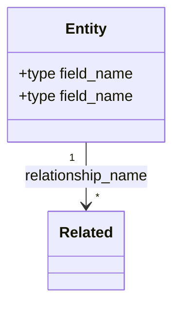
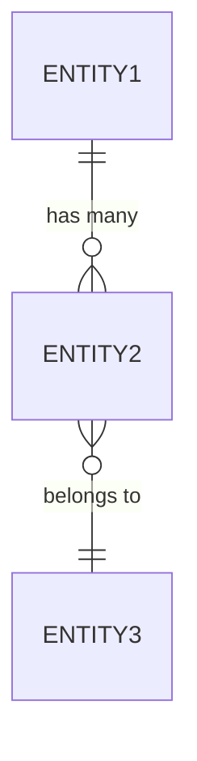

# Workflow: schema

Design data models from requirements — class diagrams, table definitions, relationships, constraints, and indexes.

## Process

### 1. Gather Domain Requirements

If not provided in arguments, determine:
- What entities exist in this domain?
- What are their relationships (1:1, 1:N, N:M)?
- What queries will run against this data? (read patterns drive schema)
- What's the expected volume and growth rate?
- What's the storage target (DynamoDB, Postgres, JSON files, etc)?

### 2. Entity Extraction

From requirements, extract:
- **Entities** — nouns with identity and lifecycle
- **Value objects** — nouns without identity (embedded)
- **Enums** — fields with fixed, known values
- **Computed fields** — derivable from other fields (document formula)
- **Temporal fields** — timestamps, durations, schedules

### 3. Class Diagram

Generate a Mermaid class diagram showing all entities, their fields with types, and relationships:



Rules:
- Use concrete types (`string`, `int`, `float`, `bool`, `long`, `map`, `list`)
- Mark computed fields with comments
- Show cardinality on all relationships
- Group related entities visually

### 4. Table Definitions

For each entity, produce a table definition:

```markdown
### T[N]: `table_name` -- Description

PK=`field` SK=`field` | GSI: PK=`field` SK=`field`

| Column | Type | Nullable | Constraints | Description |
|--------|------|----------|-------------|-------------|
| field | S/N/BOOL | NO/YES | ENUM(...), range, FK | What it represents |

Volume: estimated row count
```

Include:
- Primary key design (composite keys, sort keys)
- Secondary indexes (GSI/LSI for DynamoDB, indexes for SQL)
- Constraints (NOT NULL, ENUM, range, FK, UNIQUE)
- Computed field formulas
- Volume estimates

### 5. Access Patterns

Document the query patterns the schema supports:

```markdown
| # | Access Pattern | Table | Key Condition | Filter | Frequency |
|---|---------------|-------|---------------|--------|-----------|
| 1 | Get entity by ID | T1 | PK=id | — | High |
| 2 | List by time range | T1 | PK=entity, SK BETWEEN | — | Medium |
| 3 | Search by status | T1-GSI1 | PK=status | — | Low |
```

### 6. Relationship Diagram

If complex relationships exist, generate a separate ER diagram:



## Output Format

```markdown
## Data Model: [name]

### Overview
[1-2 sentences: what this model represents, storage target, scale]

### Class Diagram
[Mermaid classDiagram]

### Table Definitions
[One section per table]

### Access Patterns
[Access pattern table]

### Relationships
[ER diagram if needed]

### Design Decisions
1. [Why PK/SK chosen this way]
2. [Why denormalized vs normalized]
3. [Index strategy rationale]
```
