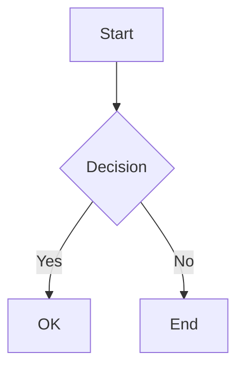
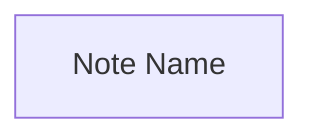

# Obsidian Formatting Reference

Obsidian uses Markdown with extensions for wikilinks, embeds, callouts, and more.

## Basic Formatting

| Syntax | Renders as |
|--------|-----------|
| `**bold**` | **bold** |
| `*italic*` | *italic* |
| `~~strikethrough~~` | ~~strikethrough~~ |
| `==highlight==` | highlighted text |
| `**_bold italic_**` | bold italic |
| `` `inline code` `` | `inline code` |

## Headings

```markdown
# H1
## H2
### H3
#### H4
##### H5
###### H6
```

## Links

### Internal Links (Wikilinks)
```markdown
[[Note Name]]                    # link to note
[[Note Name|display text]]       # aliased link
[[Note Name#heading]]            # link to heading
[[Note Name#^block-id]]          # link to block
[[Note Name#heading|display]]    # heading + alias
```

### External Links
```markdown
[text](https://url.com)
<https://url.com>                # auto-link
```

## Embeds

```markdown
![[Note Name]]                   # embed entire note
![[Note Name#heading]]           # embed heading section
![[Note Name#^block-id]]         # embed specific block
![[image.png]]                   # embed image
![[image.png|300]]               # embed image with width
![[image.png|300x200]]           # embed image with dimensions
![[audio.mp3]]                   # embed audio
![[video.mp4]]                   # embed video
![[document.pdf]]                # embed PDF
![[document.pdf#page=3]]         # embed PDF at page
![[File.base]]                   # embed a base
![[File.base#View Name]]         # embed specific base view
![[Canvas.canvas]]               # embed a canvas
```

## Lists

```markdown
- Unordered item
  - Nested item
    - Deeper nested

1. Ordered item
2. Second item
   1. Nested ordered

- [ ] Task (unchecked)
- [x] Task (checked)
```

## Blockquotes & Callouts

```markdown
> Standard blockquote
> Multiple lines

> [!note] Title
> Callout content

> [!warning] Watch out
> Important warning
```

### Callout Types
`note`, `abstract`/`summary`/`tldr`, `info`, `todo`, `tip`/`hint`/`important`, `success`/`check`/`done`, `question`/`help`/`faq`, `warning`/`caution`/`attention`, `failure`/`fail`/`missing`, `danger`/`error`, `bug`, `example`, `quote`/`cite`

### Foldable Callouts
```markdown
> [!note]+ Expanded by default
> Content

> [!note]- Collapsed by default
> Content
```

## Code Blocks

````markdown
```language
code here
```
````

Supported: `js`, `ts`, `python`, `rust`, `bash`, `yaml`, `json`, `sql`, `css`, `html`, `mermaid`, `latex`, etc.

## Tables

```markdown
| Left | Center | Right |
|:-----|:------:|------:|
| L    |   C    |     R |
```

## Diagrams (Mermaid)

````markdown

````

Supports: flowcharts, sequence diagrams, gantt charts, class diagrams, state diagrams, pie charts, etc.

### Link to Notes from Mermaid


## Math (MathJax/LaTeX)

```markdown
Inline: $E = mc^2$

Block:
$$
\frac{-b \pm \sqrt{b^2 - 4ac}}{2a}
$$
```

## Tags

```markdown
#tag
#nested/tag
#tag-with-hyphens
```

Tags in frontmatter:
```yaml
tags:
  - ai
  - machine-learning
```

- Tags are case-insensitive
- Can contain: letters, numbers, hyphens, underscores, forward slashes
- Cannot start with a number
- Nested tags create hierarchy: `#project/active`

## Footnotes

```markdown
Text with footnote[^1]

[^1]: Footnote content here.
```

## Comments

```markdown
%%
This text will not appear in preview/reading mode.
%%

Inline: text %%hidden%% more text
```

## Horizontal Rule

```markdown
---
***
___
```
(Three or more of any of these)

## Special Characters

Escape with backslash: `\*`, `\[`, `\]`, `\#`, `\|`

## Block IDs

```markdown
Any paragraph or list item ^my-block-id

Then link to it: [[Note#^my-block-id]]
```
